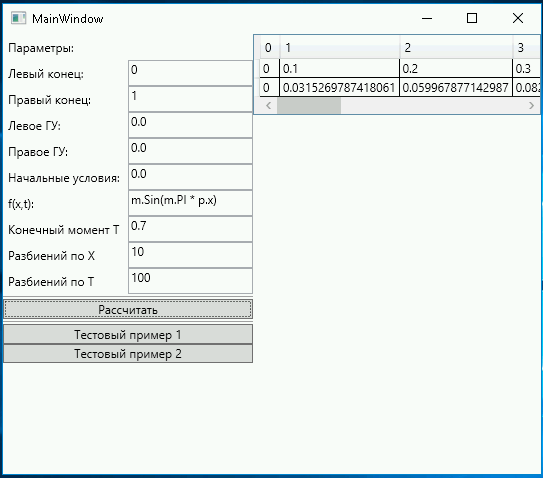

Heat Equation Numerical integration
=============

[UNN (Lobachevsky State University)](http://eng.unn.ru/), Numerical Methods discipline. Solve singe dimension [Heat Equation](https://en.wikipedia.org/wiki/Heat_equation) using [Finite difference method](https://en.wikipedia.org/wiki/Finite_difference_method).

```
Disclaimer: This code is old but I still think it is clean and nice. 
If you somewhy interested my codestyle, I advise to start from tests.
```

The most interesting part here is tests on convergence order. It is like meta correctness tests. They are here because the application should not only get correct numbers but do it for a small number of iterations.

## Input:
| Parameters         | Параметры       |
| ------------------ | -------------   |
| Target time        | Целевое время   |
| Grid step          | Шаг сетки       |
| Time stet          | Шаг времени     |
| Test case          | Тестовый пример |
| Initial condition  | НУ              |
| Boundary condition | ГУ              |
| External influence | Внешнее воздействие  |


## Output:
| Format | Формат |
| --- | --- |
| Table with absolute error on grid nodes (for known test case) | Вывести таблицу с рассчётом погрешности в узлах сетки (для тестового примера) |
| Temperature in grid nodes as plot or number of plots | Вывести изменение температуры в узлах сетки в виде графика или набора графиков |

## Algorightms:
| Options | Варианты |
| ---- | ---- |
| Explicit method | Явная разностная схема |
| Implicit method | Неявная разностная схема |

## Theoretical task:
|     |     |
| --- | --- |
| Prepare and solve analytically test case, so I can use it for tests | Подготовить и аналитически решить тестовый пример, чтобы его можно было использовать для проверки. |


